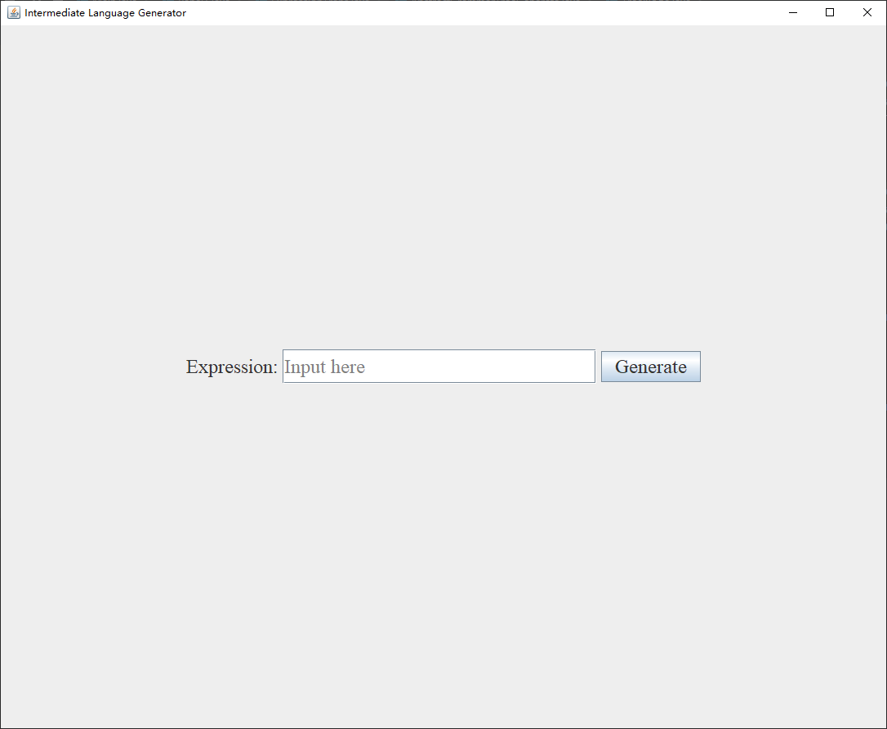
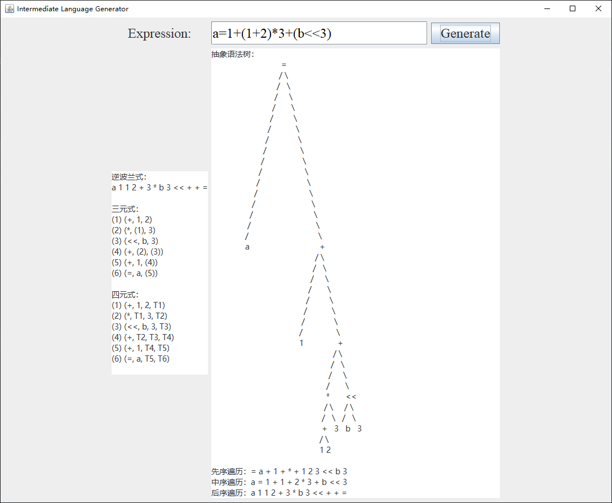
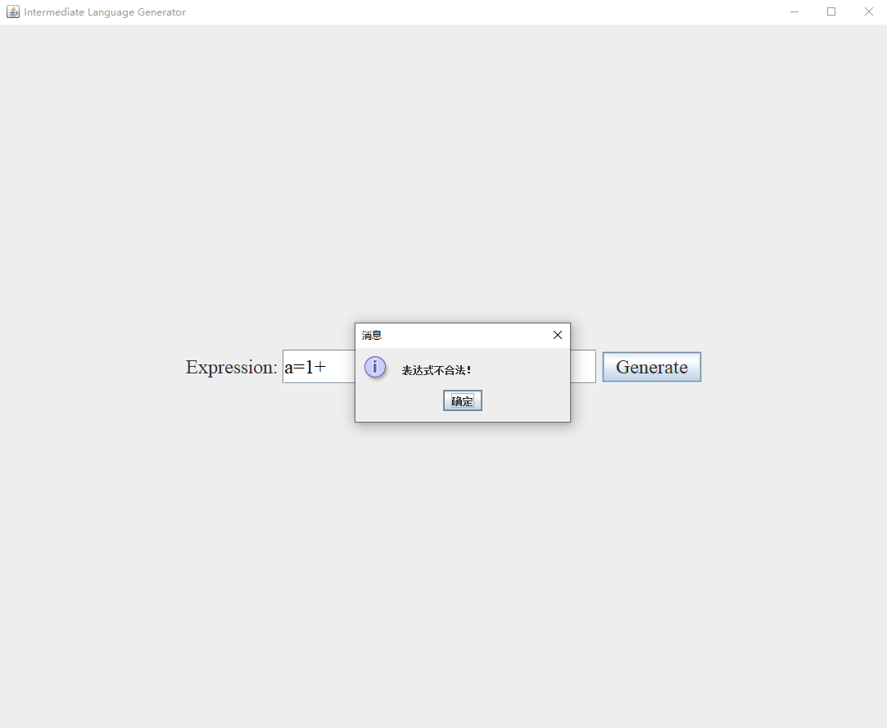

# 基于语法制导翻译思想产生中间语言

## 文件说明
① `Main.java`为程序运行入口文件，负责产生图形化窗口

② `Panel1.java`负责界面的具体设计

③ `ExpressionTrans.java`负责逆波兰式的产生，以及三元式和四元式的生成

④ `TreeNode.java`中声明了构建抽象语法树的结点

⑤ `AbstractGrammarTreeGenerate.java`负责抽象语法树的生成

## 运行说明
运行`Main.java`后，会产生一个窗口：

输入表达式后会输出逆波兰式、三元式、四元式、抽象语法树及其先序、中序、后序遍历的结果：

代码也有判错功能：

